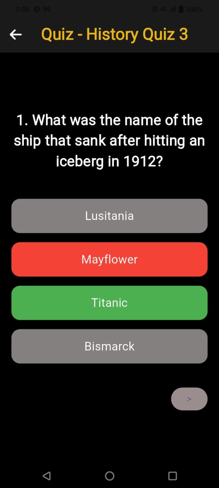

# Quizophia 📚🎉  
An interactive quiz application built using Flutter that allows users to test their knowledge across various categories like Science, History, Technology, Sports, and Geography.

## Features ✨
- 🏆 **Engaging UI**: A sleek, dark-themed interface with vibrant category cards.  
- 📚 **Multiple Categories**: Choose from Science, History, Technology, Sports, and Geography.  
- 🗘️ **Interactive Questions**: Each quiz consists of multiple-choice questions.  
- ✅ **Instant Feedback**: Correct answers are highlighted in green, and incorrect ones in red.  
- 📊 **Score Tracking**: See your score at the end of the quiz.  

<h2>Screenshots 📸</h2>

<h3>Welcome Screen</h3>


<h3>Quiz Category Selection</h3>


<h3>Quiz in Action</h3>


<h3>Quiz Completion</h3>


## Installation & Usage 🚀
1. **Clone the repository**  
   ```sh
   git clone https://github.com/PretishaSahoo/Quizophia.git
   cd quizophia
   ```
2. **Install dependencies**  
   ```sh
   flutter pub get
   ```
3. **Run the app**  
   ```sh
   flutter run
   ```

## Tech Stack 🛠️  
- **Flutter** - Cross-platform framework  
- **Dart** - Programming language  
- **Provider** - State management  

## Contributing 🤝  
Contributions are welcome! Feel free to open issues and pull requests.

## License 📝  
This project is licensed under the MIT License.  

